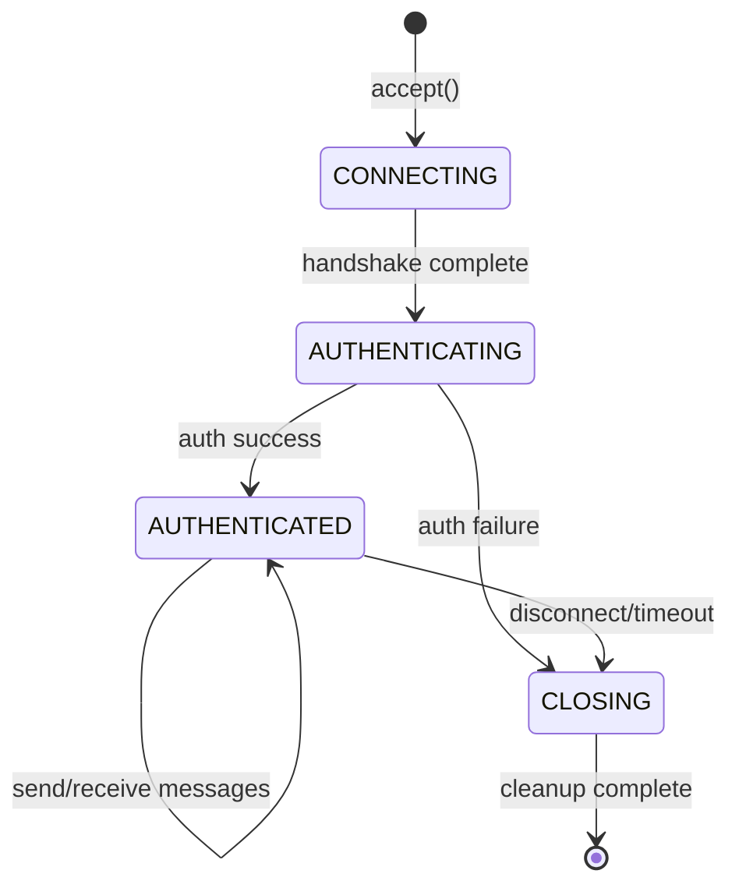
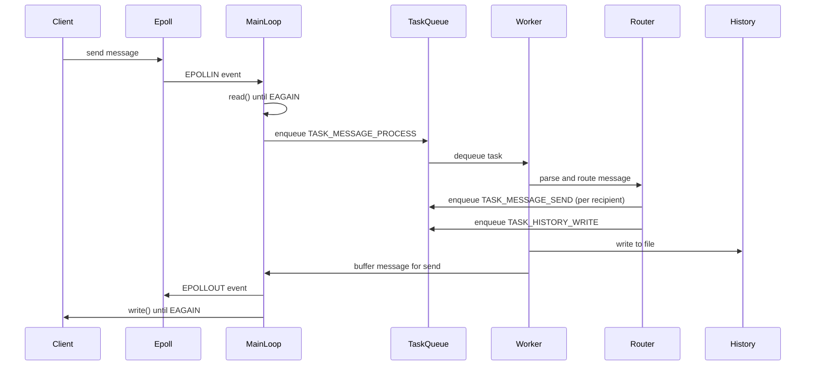

# Technical Design Document: C10K Chat Server

## Overview

The C10K Chat Server is a high-performance, event-driven chat server implemented in C that solves the C10K problem by handling 10,000+ concurrent client connections on a single Ubuntu 24.04 instance. The architecture leverages Linux epoll in edge-triggered mode combined with non-blocking I/O and a thread pool to achieve minimal latency and resource footprint.

The system consists of several key components working together:
- An epoll-based event loop that monitors thousands of socket connections with minimal CPU overhead
- A thread pool architecture that decouples network event detection from business logic processing
- Non-blocking socket operations that prevent slow clients from blocking the server
- Asynchronous file I/O for chat history persistence
- Secure authentication and session management
- Signal handling for graceful shutdown and resource cleanup
- WebSocket support for browser-based clients

This design prioritizes performance, scalability, and reliability while maintaining clean separation of concerns between networking, business logic, and data persistence layers.

## Architecture

### High-Level Architecture

The server follows an event-driven, multi-threaded architecture with clear separation between the event detection layer and the task processing layer:

```
┌─────────────────────────────────────────────────────────────┐
│                     Main Event Loop                          │
│  ┌────────────────────────────────────────────────────────┐ │
│  │         Epoll Manager (Edge-Triggered Mode)            │ │
│  │  - Monitors 10,000+ socket file descriptors           │ │
│  │  - Detects readable/writable events                   │ │
│  │  - Single-threaded, non-blocking                      │ │
│  └────────────────────────────────────────────────────────┘ │
└─────────────────────────────────────────────────────────────┘
                            │
                            ▼
┌─────────────────────────────────────────────────────────────┐
│                      Task Queue                              │
│  - Thread-safe FIFO queue                                   │
│  - Condition variable for worker notification               │
│  - Bounded capacity with backpressure                       │
└─────────────────────────────────────────────────────────────┘
                            │
                            ▼
┌─────────────────────────────────────────────────────────────┐
│                     Thread Pool                              │
│  ┌──────────┐  ┌──────────┐  ┌──────────┐  ┌──────────┐   │
│  │ Worker 1 │  │ Worker 2 │  │ Worker 3 │  │ Worker N │   │
│  │          │  │          │  │          │  │          │   │
│  │ Process  │  │ Process  │  │ Process  │  │ Process  │   │
│  │ Tasks    │  │ Tasks    │  │ Tasks    │  │ Tasks    │   │
│  └──────────┘  └──────────┘  └──────────┘  └──────────┘   │
└─────────────────────────────────────────────────────────────┘
                            │
                            ▼
┌─────────────────────────────────────────────────────────────┐
│                  Business Logic Layer                        │
│  ┌──────────────┐  ┌──────────────┐  ┌──────────────┐     │
│  │   Message    │  │   History    │  │     Auth     │     │
│  │   Router     │  │   Manager    │  │   Manager    │     │
│  └──────────────┘  └──────────────┘  └──────────────┘     │
└─────────────────────────────────────────────────────────────┘
```

### Component Interaction Flow

1. **Connection Establishment**: Client connects → Epoll Manager detects EPOLLIN → Main loop accepts connection → Sets socket to non-blocking → Adds to epoll → Enqueues authentication task

2. **Message Reception**: Epoll detects readable socket → Main loop reads all available data (edge-triggered) → Enqueues message processing task → Worker thread parses and routes message

3. **Message Delivery**: Message Router identifies recipients → Enqueues send tasks → Worker threads write to socket buffers → If EAGAIN, register for EPOLLOUT → Epoll notifies when writable

4. **History Persistence**: Message successfully routed → Enqueue history write task → Worker thread performs file I/O asynchronously

5. **Graceful Shutdown**: Signal received → Set shutdown flag → Stop accepting connections → Drain task queue → Flush history → Close all sockets → Cleanup resources

### Threading Model

- **Main Thread**: Runs the epoll event loop, accepts connections, performs non-blocking reads/writes, enqueues tasks
- **Worker Threads**: Process tasks from the queue (authentication, message routing, history writes, message sends)
- **Signal Thread**: Dedicated thread for signal handling using sigwait() to avoid race conditions

This separation ensures that the main event loop remains responsive while CPU-intensive or I/O-bound operations happen asynchronously.

## Components and Interfaces

### 1. Epoll Manager

**Responsibility**: Manages the epoll file descriptor and monitors socket events in edge-triggered mode.

**Interface**:
```c
typedef struct epoll_manager {
    int epoll_fd;
    struct epoll_event *events;
    int max_events;
} epoll_manager_t;

// Initialize epoll with specified max events
int epoll_manager_init(epoll_manager_t *manager, int max_events);

// Add a file descriptor to epoll monitoring
int epoll_manager_add(epoll_manager_t *manager, int fd, uint32_t events, void *data);

// Modify events for an existing file descriptor
int epoll_manager_modify(epoll_manager_t *manager, int fd, uint32_t events, void *data);

// Remove a file descriptor from epoll
int epoll_manager_remove(epoll_manager_t *manager, int fd);

// Wait for events (returns number of events)
int epoll_manager_wait(epoll_manager_t *manager, int timeout_ms);

// Get event at index
struct epoll_event* epoll_manager_get_event(epoll_manager_t *manager, int index);

// Cleanup epoll resources
void epoll_manager_destroy(epoll_manager_t *manager);
```

**Key Design Decisions**:
- Edge-triggered mode (EPOLLET) to minimize system calls
- Pre-allocated event array to avoid dynamic allocation in hot path
- Timeout parameter allows periodic maintenance tasks

### 2. Connection Handler

**Responsibility**: Manages individual client socket connections, handles non-blocking I/O, and maintains per-connection state.

**Interface**:
```c
typedef struct connection {
    int socket_fd;
    struct sockaddr_in addr;
    char read_buffer[READ_BUFFER_SIZE];
    size_t read_offset;
    char write_buffer[WRITE_BUFFER_SIZE];
    size_t write_offset;
    size_t write_length;
    client_session_t *session;
    time_t last_activity;
    enum conn_state state;  // CONNECTING, AUTHENTICATING, AUTHENTICATED, CLOSING
} connection_t;

// Accept new connection and set non-blocking
int connection_accept(int listen_fd, connection_t *conn);

// Set socket to non-blocking mode
int connection_set_nonblocking(int fd);

// Read available data from socket (edge-triggered)
ssize_t connection_read(connection_t *conn);

// Write buffered data to socket
ssize_t connection_write(connection_t *conn);

// Buffer data for writing
int connection_buffer_write(connection_t *conn, const char *data, size_t len);

// Close connection and cleanup
void connection_close(connection_t *conn);

// Check if connection has timed out
bool connection_is_timeout(connection_t *conn, time_t current_time, int timeout_seconds);
```

**Key Design Decisions**:
- Per-connection read and write buffers to handle partial I/O
- State machine to track connection lifecycle
- Last activity timestamp for timeout detection
- Separate read and write operations to handle EAGAIN independently

### 3. Thread Pool

**Responsibility**: Manages a pool of worker threads that process tasks asynchronously.

**Interface**:
```c
typedef enum task_type {
    TASK_AUTH,
    TASK_MESSAGE_PROCESS,
    TASK_MESSAGE_SEND,
    TASK_HISTORY_WRITE,
    TASK_CLEANUP
} task_type_t;

typedef struct task {
    task_type_t type;
    void *data;
    void (*handler)(void *data);
    struct task *next;
} task_t;

typedef struct thread_pool {
    pthread_t *threads;
    int num_threads;
    task_queue_t *queue;
    volatile bool shutdown;
} thread_pool_t;

// Initialize thread pool with specified number of workers
int thread_pool_init(thread_pool_t *pool, int num_threads);

// Submit a task to the pool
int thread_pool_submit(thread_pool_t *pool, task_t *task);

// Shutdown pool gracefully (complete queued tasks)
void thread_pool_shutdown(thread_pool_t *pool);

// Destroy pool and free resources
void thread_pool_destroy(thread_pool_t *pool);
```

### 4. Task Queue

**Responsibility**: Thread-safe FIFO queue for distributing work to thread pool workers.

**Interface**:
```c
typedef struct task_queue {
    task_t *head;
    task_t *tail;
    int size;
    int capacity;
    pthread_mutex_t mutex;
    pthread_cond_t cond_not_empty;
    pthread_cond_t cond_not_full;
} task_queue_t;

// Initialize queue with capacity
int task_queue_init(task_queue_t *queue, int capacity);

// Enqueue task (blocks if full)
int task_queue_enqueue(task_queue_t *queue, task_t *task);

// Dequeue task (blocks if empty)
task_t* task_queue_dequeue(task_queue_t *queue);

// Try to dequeue with timeout
task_t* task_queue_dequeue_timeout(task_queue_t *queue, int timeout_ms);

// Get current queue size
int task_queue_size(task_queue_t *queue);

// Destroy queue
void task_queue_destroy(task_queue_t *queue);
```

**Key Design Decisions**:
- Bounded capacity to prevent memory exhaustion under load
- Condition variables for efficient blocking/waking
- Separate conditions for full/empty states

### 5. Message Router

**Responsibility**: Parses incoming messages, identifies recipients, and routes messages to target clients.

**Interface**:
```c
typedef struct message {
    char sender[USERNAME_MAX];
    char room[ROOMNAME_MAX];
    char content[MESSAGE_MAX];
    time_t timestamp;
} message_t;

typedef struct message_router {
    connection_t **connections;
    int max_connections;
    pthread_rwlock_t lock;
} message_router_t;

// Initialize message router
int message_router_init(message_router_t *router, int max_connections);

// Parse raw message data
int message_router_parse(const char *raw_data, size_t len, message_t *msg);

// Route message to all clients in a room
int message_router_route(message_router_t *router, const message_t *msg);

// Register a connection for message routing
int message_router_register(message_router_t *router, connection_t *conn);

// Unregister a connection
void message_router_unregister(message_router_t *router, int socket_fd);

// Destroy router
void message_router_destroy(message_router_t *router);
```

**Key Design Decisions**:
- Read-write lock for concurrent access (many readers, few writers)
- Message parsing separated from routing for testability
- Room-based routing for scalability

### 6. History Manager

**Responsibility**: Persists chat messages to the file system asynchronously.

**Interface**:
```c
typedef struct history_manager {
    char base_path[PATH_MAX];
    pthread_mutex_t file_lock;
    FILE *current_file;
    char current_date[32];
} history_manager_t;

// Initialize history manager with base directory
int history_manager_init(history_manager_t *manager, const char *base_path);

// Write message to history (async via thread pool)
int history_manager_write(history_manager_t *manager, const message_t *msg);

// Flush pending writes to disk
int history_manager_flush(history_manager_t *manager);

// Rotate log file if date changed
int history_manager_rotate(history_manager_t *manager);

// Destroy and cleanup
void history_manager_destroy(history_manager_t *manager);
```

**Key Design Decisions**:
- Date-based file organization for easy archival
- Mutex protection for file handle access
- Explicit flush operation for graceful shutdown
- Automatic log rotation on date change

### 7. Auth Manager

**Responsibility**: Handles user authentication and session management.

**Interface**:
```c
typedef struct client_session {
    char username[USERNAME_MAX];
    char session_id[SESSION_ID_LEN];
    time_t created_at;
    bool authenticated;
} client_session_t;

typedef struct auth_manager {
    // Hash table: username -> password_hash
    void *credentials_db;
    // Hash table: socket_fd -> client_session
    void *sessions;
    pthread_rwlock_t lock;
} auth_manager_t;

// Initialize auth manager
int auth_manager_init(auth_manager_t *manager, const char *credentials_file);

// Authenticate user credentials
int auth_manager_authenticate(auth_manager_t *manager, const char *username, 
                               const char *password, client_session_t **session);

// Create session for authenticated user
int auth_manager_create_session(auth_manager_t *manager, const char *username,
                                 client_session_t **session);

// Get session by socket fd
client_session_t* auth_manager_get_session(auth_manager_t *manager, int socket_fd);

// Invalidate session
void auth_manager_invalidate_session(auth_manager_t *manager, int socket_fd);

// Destroy auth manager
void auth_manager_destroy(auth_manager_t *manager);
```

**Key Design Decisions**:
- Password hashing using SHA-256 or bcrypt
- Session ID generation using cryptographically secure random
- Read-write lock for concurrent session lookups
- Credentials loaded from file at startup

### 8. Signal Handler

**Responsibility**: Captures system signals and coordinates graceful shutdown.

**Interface**:
```c
typedef struct signal_handler {
    sigset_t signal_set;
    pthread_t signal_thread;
    volatile sig_atomic_t shutdown_requested;
} signal_handler_t;

// Initialize signal handler
int signal_handler_init(signal_handler_t *handler);

// Start signal handling thread
int signal_handler_start(signal_handler_t *handler);

// Check if shutdown was requested
bool signal_handler_should_shutdown(signal_handler_t *handler);

// Stop signal handler
void signal_handler_stop(signal_handler_t *handler);
```

**Key Design Decisions**:
- Dedicated thread using sigwait() to avoid async-signal-safety issues
- Blocks signals in all other threads
- Sets atomic flag for main loop to check
- Handles SIGINT, SIGTERM, ignores SIGPIPE

### 9. WebSocket Handler

**Responsibility**: Implements WebSocket protocol for browser-based clients.

**Interface**:
```c
typedef struct websocket_frame {
    uint8_t opcode;
    bool fin;
    bool masked;
    uint64_t payload_length;
    uint8_t mask_key[4];
    char *payload;
} websocket_frame_t;

// Perform WebSocket handshake
int websocket_handshake(connection_t *conn, const char *http_request);

// Parse WebSocket frame
int websocket_parse_frame(const char *data, size_t len, websocket_frame_t *frame);

// Encode data as WebSocket frame
int websocket_encode_frame(const char *data, size_t len, uint8_t opcode, 
                            char *output, size_t *output_len);

// Handle WebSocket close frame
void websocket_close(connection_t *conn, uint16_t status_code);
```

**Key Design Decisions**:
- Support for text and binary frames
- Proper masking/unmasking for client frames
- Handshake validation using SHA-1 hash
- Ping/pong for connection keepalive

## Data Models

### Connection State

```c
typedef enum conn_state {
    CONN_CONNECTING,      // Initial state, waiting for handshake
    CONN_AUTHENTICATING,  // Handshake complete, waiting for auth
    CONN_AUTHENTICATED,   // Authenticated, can send/receive messages
    CONN_CLOSING          // Shutdown initiated, draining buffers
} conn_state_t;

typedef struct connection {
    int socket_fd;
    struct sockaddr_in addr;
    char read_buffer[READ_BUFFER_SIZE];
    size_t read_offset;
    char write_buffer[WRITE_BUFFER_SIZE];
    size_t write_offset;
    size_t write_length;
    client_session_t *session;
    time_t last_activity;
    conn_state_t state;
    bool is_websocket;
} connection_t;
```

### Message Format

```c
typedef struct message {
    char sender[USERNAME_MAX];      // 64 bytes
    char room[ROOMNAME_MAX];        // 64 bytes
    char content[MESSAGE_MAX];      // 4096 bytes
    time_t timestamp;               // 8 bytes
} message_t;

// Wire format (JSON for WebSocket, binary for raw TCP):
// {
//   "type": "message",
//   "sender": "username",
//   "room": "general",
//   "content": "Hello, world!",
//   "timestamp": 1234567890
// }
```

### Session Data

```c
typedef struct client_session {
    char username[USERNAME_MAX];
    char session_id[SESSION_ID_LEN];
    char room[ROOMNAME_MAX];
    time_t created_at;
    time_t last_seen;
    bool authenticated;
    int socket_fd;
} client_session_t;
```

### Task Structure

```c
typedef enum task_type {
    TASK_AUTH,              // Authenticate user
    TASK_MESSAGE_PROCESS,   // Parse and route message
    TASK_MESSAGE_SEND,      // Send message to client
    TASK_HISTORY_WRITE,     // Write to history file
    TASK_CLEANUP            // Cleanup resources
} task_type_t;

typedef struct task {
    task_type_t type;
    void *data;
    void (*handler)(void *data);
    struct task *next;
} task_t;
```

### History File Format

Chat history is stored in daily log files organized by date and room:

```
chat_history/
├── 2024-01-15/
│   ├── general.log
│   ├── random.log
│   └── tech.log
└── 2024-01-16/
    ├── general.log
    └── random.log
```

Each log file contains newline-delimited JSON:
```json
{"timestamp":1705334400,"sender":"alice","room":"general","content":"Hello!"}
{"timestamp":1705334405,"sender":"bob","room":"general","content":"Hi Alice!"}
```

### Configuration

```c
typedef struct server_config {
    int port;
    int max_connections;
    int thread_pool_size;
    int task_queue_capacity;
    int connection_timeout_seconds;
    int epoll_timeout_ms;
    char history_base_path[PATH_MAX];
    char credentials_file[PATH_MAX];
    char static_files_path[PATH_MAX];
    int read_buffer_size;
    int write_buffer_size;
} server_config_t;

// Default configuration
#define DEFAULT_PORT 8080
#define DEFAULT_MAX_CONNECTIONS 10000
#define DEFAULT_THREAD_POOL_SIZE 8
#define DEFAULT_TASK_QUEUE_CAPACITY 1000
#define DEFAULT_CONNECTION_TIMEOUT 300
#define DEFAULT_EPOLL_TIMEOUT 100
```


## Correctness Properties

*A property is a characteristic or behavior that should hold true across all valid executions of a system—essentially, a formal statement about what the system should do. Properties serve as the bridge between human-readable specifications and machine-verifiable correctness guarantees.*

This C10K Chat Server involves significant systems programming with I/O, concurrency, and infrastructure concerns. While many requirements are best tested through integration tests, example-based unit tests, and smoke tests, several core behaviors exhibit universal properties suitable for property-based testing.

### Property 1: Non-blocking I/O Configuration

*For any* socket file descriptor created or accepted by the Connection_Handler, the socket SHALL have the O_NONBLOCK flag set.

**Validates: Requirements 1.3, 2.1, 2.2**

### Property 2: Partial I/O Integrity

*For any* data buffer and any sequence of partial read or write operations, the Connection_Handler SHALL preserve data integrity such that the complete data is eventually transmitted without corruption or loss.

**Validates: Requirements 2.5**

### Property 3: Thread-Safe Queue Consistency

*For any* sequence of concurrent enqueue and dequeue operations on the Task_Queue, the queue SHALL maintain consistency invariants: size equals the difference between enqueues and dequeues, FIFO ordering is preserved, and no tasks are lost or duplicated.

**Validates: Requirements 3.2**

### Property 4: Task Distribution Fairness

*For any* large set of tasks submitted to the Thread_Pool, the distribution of tasks across worker threads SHALL be approximately even, with variance within acceptable bounds (e.g., no worker processes more than 2x the average).

**Validates: Requirements 3.5**

### Property 5: Shutdown Completeness

*For any* server state with active connections and queued tasks, when shutdown is initiated, all connections SHALL be closed and all queued tasks SHALL complete before the server terminates.

**Validates: Requirements 4.6, 4.7**

### Property 6: Message Parsing Validity

*For any* message conforming to the defined message format, the Message_Router SHALL successfully parse the message and extract sender, room, content, and timestamp fields.

**Validates: Requirements 5.1**

### Property 7: Message Routing Completeness

*For any* chat room with N connected clients, when a message is sent to that room, the Message_Router SHALL identify all N recipients and enqueue exactly N send tasks.

**Validates: Requirements 5.2, 5.3, 5.4**

### Property 8: History Persistence Correctness

*For any* successfully routed message, the History_Manager SHALL write the message to the file system in the correct date-based directory and room-specific log file.

**Validates: Requirements 6.1, 6.3**

### Property 9: Authentication Requirement

*For any* new client connection, the Auth_Manager SHALL require successful authentication before allowing the connection to send or receive chat messages.

**Validates: Requirements 7.1**

### Property 10: Credential Validation

*For any* authentication attempt with credentials, the Auth_Manager SHALL validate the credentials against the stored credential database and return success only for matching username/password pairs.

**Validates: Requirements 7.2**

### Property 11: Session Uniqueness and Association

*For any* set of successful authentication attempts, the Auth_Manager SHALL create Client_Sessions with unique session identifiers and associate each session with its corresponding socket connection.

**Validates: Requirements 7.3, 7.4**

### Property 12: Password Hashing

*For any* password stored by the Auth_Manager, the password SHALL be hashed (not stored in plaintext) using a cryptographic hash function.

**Validates: Requirements 7.6**

### Property 13: Session Invalidation

*For any* client disconnection, the Auth_Manager SHALL invalidate the associated Client_Session such that the session cannot be used for subsequent operations.

**Validates: Requirements 7.7**

### Property 14: Edge-Triggered Read Completeness

*For any* socket with available data in edge-triggered mode, the Connection_Handler SHALL read repeatedly until EAGAIN or EWOULDBLOCK is returned, ensuring all available data is consumed.

**Validates: Requirements 8.2**

### Property 15: Edge-Triggered Write Completeness

*For any* socket with buffered data in edge-triggered mode, the Connection_Handler SHALL write repeatedly until EAGAIN or EWOULDBLOCK is returned or all buffered data is sent.

**Validates: Requirements 8.3**

### Property 16: Error Logging Completeness

*For any* socket operation that fails with an error, the Connection_Handler SHALL log the error with contextual information including the socket file descriptor and error code.

**Validates: Requirements 9.1**

### Property 17: Connection Timeout Enforcement

*For any* connection that exceeds the configured timeout period without activity, the Connection_Handler SHALL close the socket and free all associated resources.

**Validates: Requirements 9.2, 9.7**

### Property 18: Static File Serving

*For any* valid HTTP request for a static file that exists in the static files directory, the Chat_Server SHALL serve the file with appropriate content-type headers.

**Validates: Requirements 11.1**

### Property 19: WebSocket Handshake

*For any* valid WebSocket handshake request, the Connection_Handler SHALL successfully upgrade the HTTP connection to WebSocket protocol.

**Validates: Requirements 11.2**

## Error Handling

### Error Categories

The server must handle errors across multiple layers:

1. **Socket Errors**
   - EAGAIN/EWOULDBLOCK: Normal for non-blocking I/O, retry later
   - EPIPE: Broken pipe, client disconnected, close connection gracefully
   - ECONNRESET: Connection reset by peer, close connection
   - EMFILE/ENFILE: File descriptor limit reached, reject new connections
   - EINTR: Interrupted system call, retry operation

2. **Epoll Errors**
   - EBADF: Invalid file descriptor, remove from epoll
   - EEXIST: File descriptor already in epoll, handle gracefully
   - ENOENT: File descriptor not in epoll, log warning

3. **Thread Pool Errors**
   - Task queue full: Apply backpressure, block or reject
   - Thread creation failure: Log critical error, attempt degraded operation
   - Mutex/condition variable errors: Log critical error, may require restart

4. **File I/O Errors**
   - ENOSPC: Disk full, log critical error, continue operation
   - EACCES: Permission denied, log error, skip history write
   - EIO: I/O error, log error, retry with exponential backoff

5. **Authentication Errors**
   - Invalid credentials: Close connection with error message
   - Session not found: Treat as unauthenticated, require re-auth
   - Credential file missing: Log critical error, reject all auth attempts

### Error Handling Strategy

**Logging Levels**:
- DEBUG: Verbose operation details (disabled in production)
- INFO: Normal operations (connection accepted, message routed)
- WARN: Recoverable errors (EAGAIN, retry operations)
- ERROR: Serious errors (file I/O failure, socket errors)
- CRITICAL: Fatal errors (memory allocation failure, thread creation failure)

**Error Recovery**:
- Transient errors (EAGAIN, EINTR): Retry immediately
- Resource exhaustion (EMFILE): Reject new connections, log warning
- Client errors (EPIPE, ECONNRESET): Close connection, cleanup resources
- File I/O errors: Retry with exponential backoff (max 3 attempts)
- Critical errors: Log, attempt graceful shutdown

**Resource Cleanup**:
- Always close socket file descriptors on error
- Always free allocated memory on error paths
- Always remove file descriptors from epoll before closing
- Always invalidate sessions on connection close
- Use RAII-style cleanup where possible (cleanup functions)

### Timeout Handling

**Connection Timeout**:
- Track last activity timestamp per connection
- Periodic sweep (every 60 seconds) to check for timeouts
- Default timeout: 300 seconds (5 minutes)
- Send close frame to WebSocket clients before closing
- Log timeout events at INFO level

**Task Queue Timeout**:
- Worker threads use timed wait on condition variable
- Timeout allows periodic checks for shutdown flag
- Default timeout: 100ms

**Epoll Timeout**:
- Use timeout in epoll_wait() for periodic maintenance
- Default timeout: 100ms
- Allows checking shutdown flag and running timeout sweeps

## Testing Strategy

### Testing Approach

The C10K Chat Server requires a multi-layered testing strategy that combines property-based testing for core logic, example-based unit tests for specific scenarios, integration tests for system behavior, and smoke tests for configuration validation.

### Unit Tests

Unit tests focus on individual components in isolation using mocks for external dependencies:

**Connection Handler**:
- Test socket acceptance with mocked accept()
- Test non-blocking flag setting
- Test partial read/write handling with controlled buffers
- Test timeout detection with mocked timestamps
- Test error handling for EAGAIN, EPIPE, ECONNRESET

**Message Router**:
- Test message parsing with valid and invalid formats
- Test recipient identification with various room configurations
- Test task enqueueing for message delivery
- Test buffering when delivery fails

**History Manager**:
- Test file path generation for different dates/rooms
- Test log rotation on date change
- Test error handling for file I/O failures
- Test flush operation

**Auth Manager**:
- Test credential validation with valid/invalid credentials
- Test session creation and uniqueness
- Test session association with socket fds
- Test session invalidation on disconnect
- Test password hashing

**Thread Pool**:
- Test initialization with various thread counts
- Test task submission and execution
- Test graceful shutdown with queued tasks
- Test worker thread lifecycle

**Task Queue**:
- Test enqueue/dequeue operations
- Test blocking behavior when full/empty
- Test concurrent access from multiple threads
- Test capacity limits

### Property-Based Tests

Property-based tests verify universal properties across many generated inputs using a PBT library for C (e.g., theft, QuickCheck for C, or custom implementation):

**Configuration**: Minimum 100 iterations per property test

**Test Tags**: Each property test must include a comment referencing the design property:
```c
// Feature: c10k-chat-server, Property 1: Non-blocking I/O Configuration
```

**Properties to Implement**:

1. **Non-blocking I/O Configuration** (Property 1)
   - Generate various socket scenarios
   - Verify O_NONBLOCK flag is set on all sockets

2. **Partial I/O Integrity** (Property 2)
   - Generate random data buffers and partial read/write sequences
   - Verify complete data transmission without corruption

3. **Thread-Safe Queue Consistency** (Property 3)
   - Generate random concurrent enqueue/dequeue operations
   - Verify queue size, ordering, and no data loss

4. **Task Distribution Fairness** (Property 4)
   - Generate large sets of tasks
   - Verify distribution variance across workers

5. **Shutdown Completeness** (Property 5)
   - Generate random server states with connections and tasks
   - Verify all resources cleaned up on shutdown

6. **Message Parsing Validity** (Property 6)
   - Generate random valid messages
   - Verify successful parsing of all fields

7. **Message Routing Completeness** (Property 7)
   - Generate random room configurations
   - Verify all recipients receive messages

8. **History Persistence Correctness** (Property 8)
   - Generate random messages with various dates/rooms
   - Verify correct file organization

9. **Authentication Requirement** (Property 9)
   - Generate random connection attempts
   - Verify authentication required before chat access

10. **Credential Validation** (Property 10)
    - Generate random valid/invalid credentials
    - Verify correct validation results

11. **Session Uniqueness and Association** (Property 11)
    - Generate multiple authentication attempts
    - Verify unique session IDs and correct associations

12. **Password Hashing** (Property 12)
    - Generate random passwords
    - Verify all are hashed, none stored plaintext

13. **Session Invalidation** (Property 13)
    - Generate random disconnections
    - Verify sessions invalidated

14. **Edge-Triggered Read Completeness** (Property 14)
    - Mock sockets with varying data amounts
    - Verify read until EAGAIN

15. **Edge-Triggered Write Completeness** (Property 15)
    - Mock sockets with varying buffer sizes
    - Verify write until EAGAIN

16. **Error Logging Completeness** (Property 16)
    - Generate various socket errors
    - Verify all logged with context

17. **Connection Timeout Enforcement** (Property 17)
    - Generate connections with various activity times
    - Verify timeouts handled correctly

18. **Static File Serving** (Property 18)
    - Generate random valid file requests
    - Verify correct files served

19. **WebSocket Handshake** (Property 19)
    - Generate random valid handshakes
    - Verify upgrade succeeds

### Integration Tests

Integration tests verify system behavior with real components:

**Concurrency Test**:
- Simulate 10,000+ concurrent connections
- Verify server remains responsive
- Measure latency and throughput
- Use load testing tools (e.g., wrk, ab)

**End-to-End Message Flow**:
- Connect multiple clients
- Send messages between clients
- Verify real-time delivery
- Verify history persistence
- Verify correct file organization

**WebSocket Integration**:
- Connect browser clients via WebSocket
- Verify handshake upgrade
- Verify bidirectional communication
- Verify message framing

**Graceful Shutdown**:
- Start server with active connections and pending tasks
- Send SIGTERM
- Verify all connections closed
- Verify all tasks completed
- Verify history flushed
- Verify no memory leaks (valgrind)

**Resource Limits**:
- Test behavior at file descriptor limit
- Test behavior with disk full
- Test behavior with memory pressure

### Smoke Tests

Smoke tests verify one-time configuration and setup:

- Verify epoll configured with EPOLLET flag
- Verify SIGPIPE is ignored
- Verify CMake version 3.10+
- Verify build produces c10k-chat-server binary
- Verify compiler flags include warnings and optimizations
- Verify pthread library is linked

### Performance Tests

Performance tests verify scalability and resource usage:

**Throughput Test**:
- Measure messages per second with varying client counts
- Target: 100,000+ messages/second with 10,000 clients

**Latency Test**:
- Measure message delivery latency
- Target: p99 latency < 10ms under normal load

**Resource Usage**:
- Measure CPU usage with 10,000 clients
- Measure memory usage per connection
- Target: < 10KB memory per connection

**Connection Handling**:
- Measure time to accept 10,000 connections
- Verify no connection rejections under limit

### Test Infrastructure

**Mocking Framework**:
- Use cmocka or similar for C unit testing
- Mock system calls (socket, accept, read, write, epoll_*)
- Mock file I/O operations
- Mock time functions for timeout testing

**Property-Based Testing Library**:
- Use theft or implement custom PBT framework
- Implement generators for:
  - Random socket file descriptors
  - Random data buffers
  - Random message structures
  - Random room configurations
  - Random credentials

**Load Testing Tools**:
- wrk for HTTP/WebSocket load testing
- Custom C client for raw TCP testing
- Scripts to simulate 10,000+ concurrent connections

**Memory Testing**:
- Valgrind for memory leak detection
- AddressSanitizer for memory errors
- Run all tests under memory checkers

### Continuous Integration

**Build Pipeline**:
1. Compile with warnings as errors
2. Run unit tests
3. Run property-based tests (100 iterations each)
4. Run integration tests
5. Run smoke tests
6. Run memory leak detection
7. Generate coverage report (target: 80%+ coverage)

**Performance Regression Testing**:
- Run performance tests on each commit
- Alert on regressions > 10%
- Track metrics over time


## Implementation Notes

### Memory Management

**Allocation Strategy**:
- Pre-allocate connection pool at startup (10,000 connection structs)
- Pre-allocate epoll event array (1024 events per epoll_wait call)
- Use memory pools for frequently allocated objects (tasks, messages)
- Avoid dynamic allocation in hot paths (event loop)

**Cleanup Patterns**:
```c
// RAII-style cleanup using goto
int process_connection(int fd) {
    connection_t *conn = NULL;
    message_t *msg = NULL;
    
    conn = connection_alloc();
    if (!conn) goto cleanup;
    
    msg = message_alloc();
    if (!msg) goto cleanup;
    
    // ... processing ...
    
cleanup:
    if (msg) message_free(msg);
    if (conn) connection_free(conn);
    return result;
}
```

### Concurrency Considerations

**Lock Hierarchy** (to prevent deadlocks):
1. Task queue lock
2. Message router lock
3. Auth manager lock
4. History manager lock

**Lock-Free Patterns**:
- Use atomic operations for shutdown flag
- Use atomic operations for connection counters
- Consider lock-free queue for task queue (future optimization)

**Read-Write Locks**:
- Message router: Many readers (routing messages), few writers (adding/removing connections)
- Auth manager: Many readers (session lookups), few writers (session creation/invalidation)

### Performance Optimizations

**Zero-Copy Techniques**:
- Use sendfile() for serving static files
- Use splice() for proxying data (future enhancement)
- Minimize buffer copies in message routing

**CPU Affinity**:
- Pin worker threads to specific CPU cores
- Pin main thread to dedicated core
- Reduce context switching and cache misses

**NUMA Awareness**:
- Allocate memory on same NUMA node as processing thread
- Consider NUMA topology for thread placement

**Batching**:
- Process multiple epoll events before yielding
- Batch history writes (buffer multiple messages)
- Batch task submissions to reduce lock contention

### Security Considerations

**Input Validation**:
- Validate all message fields (length, content)
- Sanitize usernames and room names
- Prevent buffer overflows with strict bounds checking
- Validate WebSocket frames (masking, length)

**Authentication**:
- Use bcrypt or Argon2 for password hashing
- Implement rate limiting for authentication attempts
- Use cryptographically secure random for session IDs
- Consider adding HTTPS/TLS support (future enhancement)

**Resource Limits**:
- Limit message size (4KB default)
- Limit username/room name length (64 bytes)
- Limit connections per IP address
- Implement connection rate limiting

**Denial of Service Protection**:
- Connection timeout to prevent resource exhaustion
- Task queue capacity to prevent memory exhaustion
- Slowloris protection (timeout inactive connections)
- Validate WebSocket frame sizes

### Monitoring and Observability

**Metrics to Track**:
- Active connections count
- Messages per second
- Task queue depth
- Worker thread utilization
- Memory usage per connection
- File descriptor usage
- Error rates by type
- Latency percentiles (p50, p95, p99)

**Logging Strategy**:
- Structured logging (JSON format)
- Log rotation by size and date
- Separate log files for errors and access logs
- Include correlation IDs for request tracing

**Health Checks**:
- HTTP endpoint for health status
- Check epoll fd is valid
- Check thread pool is responsive
- Check file descriptor usage < 90%
- Check memory usage < threshold

### Deployment Considerations

**System Configuration**:
```bash
# Increase file descriptor limit
ulimit -n 100000

# Increase ephemeral port range
sysctl -w net.ipv4.ip_local_port_range="1024 65535"

# Enable TCP fast open
sysctl -w net.ipv4.tcp_fastopen=3

# Increase socket buffer sizes
sysctl -w net.core.rmem_max=16777216
sysctl -w net.core.wmem_max=16777216

# Increase connection backlog
sysctl -w net.core.somaxconn=4096
```

**Systemd Service**:
```ini
[Unit]
Description=C10K Chat Server
After=network.target

[Service]
Type=simple
User=chatserver
Group=chatserver
ExecStart=/usr/local/bin/c10k-chat-server --config /etc/chatserver/config.conf
Restart=on-failure
RestartSec=5
LimitNOFILE=100000

[Install]
WantedBy=multi-user.target
```

**Configuration File Format**:
```ini
[server]
port=8080
max_connections=10000
thread_pool_size=8
connection_timeout=300

[paths]
history_base=/var/lib/chatserver/history
credentials_file=/etc/chatserver/credentials.db
static_files=/var/www/chatserver

[logging]
level=INFO
file=/var/log/chatserver/server.log
max_size=100M
```

### Build System Details

**CMakeLists.txt Structure**:
```cmake
cmake_minimum_required(VERSION 3.10)
project(c10k-chat-server C)

set(CMAKE_C_STANDARD 11)
set(CMAKE_C_STANDARD_REQUIRED ON)

# Compiler flags
set(CMAKE_C_FLAGS "${CMAKE_C_FLAGS} -Wall -Wextra -Werror -pedantic")
set(CMAKE_C_FLAGS_DEBUG "-g -O0 -DDEBUG")
set(CMAKE_C_FLAGS_RELEASE "-O3 -DNDEBUG")

# Source files
set(SOURCES
    src/main.c
    src/epoll_manager.c
    src/connection_handler.c
    src/thread_pool.c
    src/task_queue.c
    src/message_router.c
    src/history_manager.c
    src/auth_manager.c
    src/signal_handler.c
    src/websocket_handler.c
)

# Executable
add_executable(c10k-chat-server ${SOURCES})

# Link libraries
target_link_libraries(c10k-chat-server pthread)

# Include directories
target_include_directories(c10k-chat-server PRIVATE include)

# Install
install(TARGETS c10k-chat-server DESTINATION bin)
```

### Project Structure

```
c10k-chat-server/
├── CMakeLists.txt
├── README.md
├── LICENSE
├── include/
│   ├── epoll_manager.h
│   ├── connection_handler.h
│   ├── thread_pool.h
│   ├── task_queue.h
│   ├── message_router.h
│   ├── history_manager.h
│   ├── auth_manager.h
│   ├── signal_handler.h
│   ├── websocket_handler.h
│   └── common.h
├── src/
│   ├── main.c
│   ├── epoll_manager.c
│   ├── connection_handler.c
│   ├── thread_pool.c
│   ├── task_queue.c
│   ├── message_router.c
│   ├── history_manager.c
│   ├── auth_manager.c
│   ├── signal_handler.c
│   └── websocket_handler.c
├── tests/
│   ├── unit/
│   │   ├── test_epoll_manager.c
│   │   ├── test_connection_handler.c
│   │   ├── test_thread_pool.c
│   │   ├── test_task_queue.c
│   │   ├── test_message_router.c
│   │   ├── test_history_manager.c
│   │   ├── test_auth_manager.c
│   │   └── test_websocket_handler.c
│   ├── property/
│   │   ├── test_properties.c
│   │   └── generators.c
│   └── integration/
│       ├── test_e2e.c
│       └── test_load.c
├── web/
│   ├── index.html
│   ├── style.css
│   └── app.js
└── config/
    ├── config.conf.example
    └── credentials.db.example
```

### State Machine Diagrams

**Connection State Machine**:


**Message Processing Flow**:


### WebSocket Protocol Implementation

**Handshake Process**:
1. Client sends HTTP Upgrade request with Sec-WebSocket-Key
2. Server validates request headers
3. Server computes Sec-WebSocket-Accept using SHA-1
4. Server sends 101 Switching Protocols response
5. Connection upgraded to WebSocket

**Frame Format**:
```
 0                   1                   2                   3
 0 1 2 3 4 5 6 7 8 9 0 1 2 3 4 5 6 7 8 9 0 1 2 3 4 5 6 7 8 9 0 1
+-+-+-+-+-------+-+-------------+-------------------------------+
|F|R|R|R| opcode|M| Payload len |    Extended payload length    |
|I|S|S|S|  (4)  |A|     (7)     |             (16/64)           |
|N|V|V|V|       |S|             |   (if payload len==126/127)   |
| |1|2|3|       |K|             |                               |
+-+-+-+-+-------+-+-------------+ - - - - - - - - - - - - - - - +
|     Extended payload length continued, if payload len == 127  |
+ - - - - - - - - - - - - - - - +-------------------------------+
|                               |Masking-key, if MASK set to 1  |
+-------------------------------+-------------------------------+
| Masking-key (continued)       |          Payload Data         |
+-------------------------------- - - - - - - - - - - - - - - - +
:                     Payload Data continued ...                :
+ - - - - - - - - - - - - - - - - - - - - - - - - - - - - - - - +
|                     Payload Data continued ...                |
+---------------------------------------------------------------+
```

**Opcodes**:
- 0x0: Continuation frame
- 0x1: Text frame
- 0x2: Binary frame
- 0x8: Close frame
- 0x9: Ping frame
- 0xA: Pong frame

### Frontend Implementation

**HTML Structure** (web/index.html):
```html
<!DOCTYPE html>
<html>
<head>
    <title>C10K Chat</title>
    <link rel="stylesheet" href="style.css">
</head>
<body>
    <div id="login-screen">
        <h1>C10K Chat</h1>
        <form id="login-form">
            <input type="text" id="username" placeholder="Username" required>
            <input type="password" id="password" placeholder="Password" required>
            <button type="submit">Login</button>
        </form>
    </div>
    <div id="chat-screen" style="display:none;">
        <div id="chat-header">
            <span id="current-user"></span>
            <span id="current-room"></span>
            <button id="logout-btn">Logout</button>
        </div>
        <div id="chat-messages"></div>
        <form id="message-form">
            <input type="text" id="message-input" placeholder="Type a message..." required>
            <button type="submit">Send</button>
        </form>
    </div>
    <script src="app.js"></script>
</body>
</html>
```

**JavaScript WebSocket Client** (web/app.js):
```javascript
class ChatClient {
    constructor() {
        this.ws = null;
        this.username = null;
    }

    connect() {
        this.ws = new WebSocket('ws://localhost:8080/ws');
        
        this.ws.onopen = () => {
            console.log('Connected to server');
        };
        
        this.ws.onmessage = (event) => {
            const message = JSON.parse(event.data);
            this.handleMessage(message);
        };
        
        this.ws.onerror = (error) => {
            console.error('WebSocket error:', error);
        };
        
        this.ws.onclose = () => {
            console.log('Disconnected from server');
        };
    }

    login(username, password) {
        const authMessage = {
            type: 'auth',
            username: username,
            password: password
        };
        this.ws.send(JSON.stringify(authMessage));
    }

    sendMessage(content, room) {
        const message = {
            type: 'message',
            sender: this.username,
            room: room,
            content: content,
            timestamp: Date.now()
        };
        this.ws.send(JSON.stringify(message));
    }

    handleMessage(message) {
        switch(message.type) {
            case 'auth_success':
                this.username = message.username;
                this.showChatScreen();
                break;
            case 'auth_failure':
                alert('Authentication failed');
                break;
            case 'message':
                this.displayMessage(message);
                break;
            case 'history':
                this.displayHistory(message.messages);
                break;
        }
    }

    displayMessage(message) {
        const messagesDiv = document.getElementById('chat-messages');
        const messageEl = document.createElement('div');
        messageEl.className = 'message';
        messageEl.innerHTML = `
            <span class="sender">${message.sender}</span>
            <span class="timestamp">${new Date(message.timestamp).toLocaleTimeString()}</span>
            <div class="content">${message.content}</div>
        `;
        messagesDiv.appendChild(messageEl);
        messagesDiv.scrollTop = messagesDiv.scrollHeight;
    }

    showChatScreen() {
        document.getElementById('login-screen').style.display = 'none';
        document.getElementById('chat-screen').style.display = 'block';
        document.getElementById('current-user').textContent = this.username;
    }
}

// Initialize client
const client = new ChatClient();
client.connect();

// Event listeners
document.getElementById('login-form').addEventListener('submit', (e) => {
    e.preventDefault();
    const username = document.getElementById('username').value;
    const password = document.getElementById('password').value;
    client.login(username, password);
});

document.getElementById('message-form').addEventListener('submit', (e) => {
    e.preventDefault();
    const content = document.getElementById('message-input').value;
    const room = document.getElementById('current-room').textContent || 'general';
    client.sendMessage(content, room);
    document.getElementById('message-input').value = '';
});
```

## Summary

This technical design provides a comprehensive blueprint for implementing a high-performance C10K Chat Server that handles 10,000+ concurrent connections using Linux epoll in edge-triggered mode. The architecture separates concerns between network event detection (main epoll loop) and business logic processing (thread pool), ensuring the server remains responsive under heavy load.

Key design decisions include:
- Edge-triggered epoll for minimal system calls
- Non-blocking I/O throughout to prevent blocking on slow clients
- Thread pool for asynchronous task processing
- Pre-allocated memory pools to avoid allocation in hot paths
- Comprehensive error handling and graceful shutdown
- Property-based testing for core correctness properties
- WebSocket support for browser-based clients

The design prioritizes performance, scalability, and reliability while maintaining clean interfaces between components for testability and maintainability.

